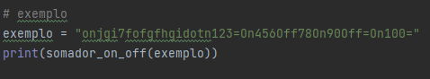
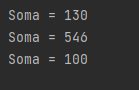

# TPC1: Somador on/off

## 12/02/2025

## Autor

- A94557
- Délio Miguel Lopes Alves

## Enunciado

Somador on/off: criar o programa em Python

    1. Pretende-se um programa que some todas as sequências de dígitos que encontre num texto;

    2. Sempre que encontrar a string “Off” em qualquer combinação de maiúsculas e minúsculas, esse comportamento é desligado;

    3. Sempre que encontrar a string “On” em qualquer combinação de maiúsculas e minúsculas, esse comportamento é novamente ligado;

    4. Sempre que encontrar o caráter “=”, o resultado da soma é colocado na saída.

## Explicação

    r'\d+|[oO][nN]|[oO][fF]{2}|='

- **\d+ -** para um ou mais dígitos numéricos

- **[oO][nN] -** para a palavra "ON" ou "on" (insensível a maiúsculas/minúsculas)

- **[oO][fF]{2} -** para a palavra "OFF" ou "off" (insensível a maiúsculas/minúsculas)

- **= -** para o símbolo =

### Variáveis

- **soma -** mantém a soma dos números enquanto ON está ativo

- **somar -** funciona como uma flag, para saber quais os números devem ser somados ou não

- **resultado -** guarda os resultados a serem retornados

A função percorre a string de entrada e, para cada correspondência encontrada pela expressão regular, executa as seguintes ações:

    Comando "ON": Ativa o modo de soma, permitindo que números subsequentes sejam adicionados à soma atual.
    Comando "OFF": Desativa o modo de soma, impedindo que números subsequentes sejam adicionados.
    Símbolo "=": Registra o valor da soma atual no resultado e reinicia a soma para zero.
    Números: Se o modo de soma estiver ativo, adiciona o número à soma atual.

## Resultados

Exemplo:

Resultado:

