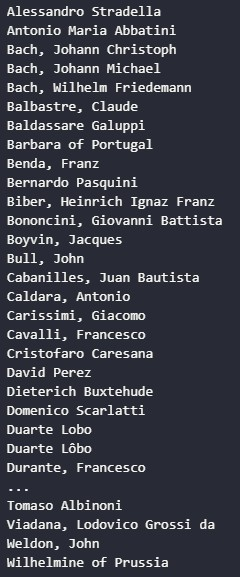
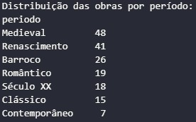

# TPC2: Análise de um dataset de obras musicais

## 20/02/2025

## Autor

- A94557
- Délio Miguel Lopes Alves

## Enunciado

Neste TPC, é proibido usar o módulo CSV do Python;

Deverás ler o dataset, processá-lo e criar os seguintes resultados:

    1. Lista ordenada alfabeticamente dos compositores musicais;

    2. Distribuição das obras por período: quantas obras catalogadas em cada período;

    3. Dicionário em que a cada período está a associada uma lista alfabética dos títulos das obras desse período.

## Resultados

    1. Lista ordenada alfabeticamente dos compositores musicais;

    2. Distribuição das obras por período: quantas obras catalogadas em cada período;

    3. Dicionário em que a cada período está a associada uma lista alfabética dos títulos das obras desse período.

    Dicionário de obras por período:

Barroco: ['Ab Irato', 'Die Ideale S106', 'Fantasy No 2', 'Hungarian Rhapsody No 16', 'Hungarian Rhapsody No 5', 'Hungarian Rhapsody No 8', 'Impromptu Op51', 'In the Steppes of Central Asia', 'Mazurkas Op 50', 'Military Band No 1', 'Nocturne in C minor', 'Paganini Variations Book I', 'Polonaise Op 44', 'PolonaiseFantasie', 'Polonaises Op71', 'Preludes Op 11', 'Preludes Op 49', 'Prince Rostislav', 'Rage Over a Lost Penny', 'Rondo Op 5', 'Shéhérazade ouverture de féerie', 'Symphonies de Beethoven', 'The Rondo', 'Transcendental Études', 'Études Op 25', 'Études Op10']

Clássico: ['Bamboula Op 2', 'Capriccio Italien', 'Czech Suite', 'French Overture', 'Hungarian Rhapsody No 14', 'Hungarian Rhapsody No 18', 'Händelgesellschaft volume 50', 'In Natures Realm', 'Mass in C major', 'Scherzo No3', 'Serenade for Strings in G minor', 'Serenata Notturna', 'Stabat Mater', 'Suite for Orchestra in B minor', 'Zärtliche Liebe']

Medieval: ['Adagio in B minor', 'Ballade No1', 'Ballades Op 10', 'Barcarole Op 60', 'Coriolan Overture', 'Dixit Dominus', 'Eroica Variations', 'Fantasia and Fugue BWV 542 G minor', 'Fantasia in D minor', 'Fantasy on Hungarian Folk Themes', 'Faust Overture', 'Gigue in G major K 574', 'Grande valse brillante', 'Hungarian Rhapsody No 11', 'Hungarian Rhapsody No 13', 'Hungarian Rhapsody No 15', 'Hungarian Rhapsody No 3', 'Hungarian Rhapsody No 4', 'Hungarian Rhapsody No 7', 'Impromptu Op 29', 'La Savane', 'Mazurkas Op 30', 'Mazurkas Op 63', 'Mazurkas Op 67', 'Mazurkas Op 68', 'Morceau de salon', 'Preludes Op 11 No 4', 'Preludes Op 74', 'Première rhapsodie', 'Prélude Choral et Fugue', 'Rhapsodie Espagnole', 'Romance in F major', 'Rondo for Piano No 3', 'Serenade for Strings', 'Serenade for Wind Instruments', 'Suite No 1 for two pianos', 'Suite No 2 for two pianos', 'Suite in D minor HWV 437', 'Tapiola', 'The Noon Witch', 'Three Pieces for Orchestra', 'Tragic Overture', 'Transcendental Études', 'Tönet ihr Pauken Erschallet Trompeten BWV 214', 'Valses Sentimentales', 'Variations in F minor', 'Variations on a Theme of Corelli Op 42', 'Wedding day at Troldhaugen']

Renascimento: ['Bagatelles Opus 119', 'Bagatelles Opus 33', 'Cantatas BWV 141150', 'Carnival Overture', 'Estampes', 'Fantaisie brillante Op 22', 'Festklänge S101', 'Funeral March in Memory of Rikard Nordraak', 'Hamlet S104', 'Hungarian Rhapsody No 10', 'Hungarian Rhapsody No 12', 'Hungarian Rhapsody No1', 'Komm Jesu komm', 'LArt de varier', 'Le Mancenillier', 'Legends Op59', 'Liturgy of St John Chrysostom', 'MarieMagdeleine', 'Mazurkas Op 56', 'Morceaux de Salon Op 10', 'Nocturne in Aflat', 'Othello', 'Polonaises Op26', 'Preludes Op 11', 'Preludes Op 32', 'Romance in G major', 'Rondo Op 1', 'Scans of the Bach Gesellschaft edition of the Eight Short Preludes and Fugues', 'Scherzo No4', 'Schuberts Valses Nobles', 'Shéhérazade', 'Six Pieces for Piano Op 118', 'St Pauls Suite', 'Symphonic Dances Op 64', 'The Creatures of Prometheus', 'Transcendental Études', 'Valse romantique', 'Variation on a Waltz by Diabelli', 'Vers la flamme', 'Études Op 25']

Século XX: ['Berceuse', 'Eleven Chorale Preludes Op 122', 'Fürchte dich nicht', 'Hungarian Rhapsody No 17', 'Hungarian Rhapsody No 9', 'Nocturnes Op Posth 72', 'Papillons', 'Peer Gynt Suite Suite No 1', 'Serenade for Strings', 'Sigurd Jorsalfar', 'Singet dem Herrn ein neues Lied', 'Sonatas and Partitas for Solo Violin', 'Sonatina in F major', 'Sonatina in G', 'Symphonic Poem No1 Ce quon entend sur la montagne', 'The Storm Op76', 'Variations on a Theme of Chopin Op 22', 'Études Op 25']

Romântico: ['Book II', 'Fantasy No 4', 'Feu dartifice', 'Feuilles dAlbum', 'Grande Tarantelle', 'Jeux denfants', 'Lobet den Herrn alle Heiden', 'Moments musicaux', 'Overture Scherzo and Finale', 'Preludes Op 11', 'Preludes Op 59', 'Präludium und Fuge über das Thema BACH', 'Psalm 42  Op 42', 'Salve Regina', 'Scherzo No 2', 'Syrinx', 'Waltzes Op 34', 'Études Op 25', 'Études Op10']

Contemporâneo: ['Impromptu Op 36', 'Les cinq doigts', 'Polonaises Op40', 'Preludes Opus 51', 'Rhapsodies Op 79', 'Sonnerie de SteGeneviève du MontdeParis', 'Études Op 25']

