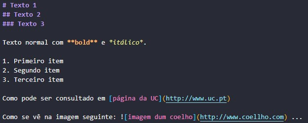
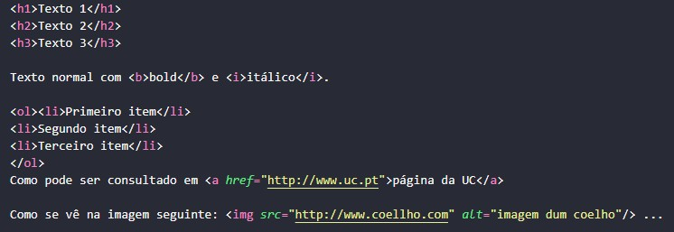

# TPC3: Conversor de MarkDown para HTML

## 27/02/2025

## Autor

- A94557
- Délio Miguel Lopes Alves

## Enunciado

Criar em Python um pequeno conversor de MarkDown para HTML para os elementos descritos na "Basic Syntax" da Cheat Sheet:

    1. Cabeçalhos: linhas iniciadas por "# texto", ou "## texto" ou "### texto"

    2. Bold: pedaços de texto entre "**":

    3. Itálico: pedaços de texto entre "*":

    4. Lista numerada:
    
    5. Link: [texto](endereço URL)

    6. Imagem: 

## Explicação

**markdown_to_html(md_text):** Esta função recebe um texto em Markdown e realiza substituições com uso expressões regulares e re.sub para convertê-lo em HTML.

Foi necessário modificar a ordem da substituição de imagens e links, coloquei a conversão de imagens primeiro. Inicialmente, a conversão de links era realizada antes da conversão de imagens. Como a expressão regular do link é mais abrangente do que das imagens, a conversão não estava a ser realizada corretamente. Ao inverter a ordem, garantimos que imagens sejam processadas corretamente.

## Resultados

### Exemplo

### Resultado

