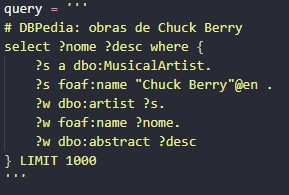

# TPC4: Analisador Léxico

## 06/03/2025

## Autor

- A94557
- Délio Miguel Lopes Alves

## Enunciado

Construir um analisador léxico para uma liguagem de query com a qual se podem escrever frases do género:

    # DBPedia: obras de Chuck Berry 
 
    select ?nome ?desc where { 
        ?s a dbo:MusicalArtist. 
        ?s foaf:name "Chuck Berry"@en . 
        ?w dbo:artist ?s. 
        ?w foaf:name ?nome. 
        ?w dbo:abstract ?desc 
    } LIMIT 1000 

## Explicação

O analisador léxico foi construído com a utilização expressões regulares para reconhecer os diferentes tokens presentes nas consultas. Os principais passos do desenvolvimento foram:

### Definição dos Tokens
Os tokens representam os elementos básicos da linguagem de consulta, inclui:

**Palavras-chave:** SELECT, WHERE, LIMIT

**Identificadores:** Variáveis iniciadas por ?, como ?s, ?w, ?nome

**Nomes prefixados:** Elementos como dbo:MusicalArtist, foaf:name

**Tipos RDF:** O termo a, utilizado como sinônimo de rdf:type, foi incluído na mesma categoria de nomes prefixados.

**Strings com rótulos de idioma:** Separação entre o conteúdo textual e o indicador de idioma (exemplo: "Chuck Berry"@en → STRING + LANG_TAG).

**Números:** Valores numéricos

**Símbolos Especiais:** {, }, .

**Comentários:** Linhas iniciadas por #, permite adicionar descrições dentro das consultas.

## Resultados

### Exemplo

### Resultado

