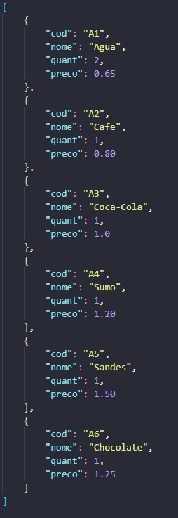
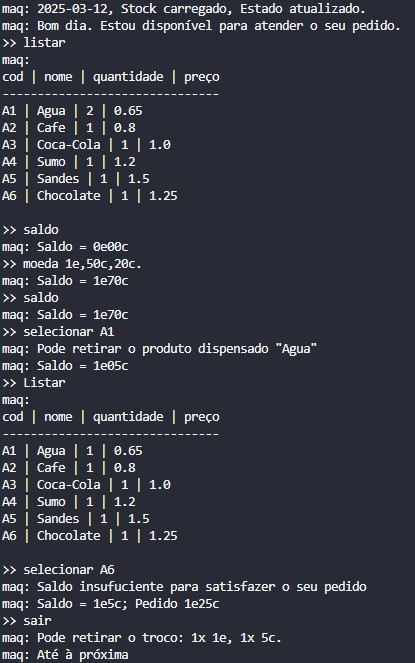

# TPC3: Máquina de vending

## 12/03/2025

## Autor

- A94557
- Délio Miguel Lopes Alves

## Enunciado

Pediram-te para construir um programa que simule uma máquina de vending.

A máquina tem um stock de produtos: uma lista de triplos, nome do produto, quantidade e preço.

    stock = [
        {"cod": "A23", "nome": "água 0.5L", "quant": 8, "preco": 0.7},
        ...
    ]

Podes persistir essa lista num ficheiro em JSON que é carregado no arranque do programa e é atulizado quando o programa termina.

O stock encontra-se inicialmente armazenado num ficheiro JSON de nome "stock.json" que é carregado em memória quando o programa arranca. Quando o programa termina, o stock é gravado no mesmo ficheiro, mantendo assim o estado da aplicação entre interações.

Use a imaginação e criatividade e tente contemplar todos os cenários, por exemplo, produto inexistente ou stock vazio.

Como extra pode adicionar um comando para adicionar alguns produtos ao stock existente (produtos novos ou já existentes).

## Explicação

O programa usa PLY (Python Lex-Yacc) para criar um lexer que reconhece e processa comandos digitados pelo utilizador. O lexer identifica palavras-chave específicas e valores numéricos, transformando-os em tokens.

**Definição de Tokens**

Os tokens representam os diferentes comandos que podem ser reconhecidos pelo lexer:

**MOEDA** – Para inserir moedas na máquina.

**LISTAR** – Para listar os produtos disponíveis.

**SELECIONAR** – Para escolher um produto.

**SAIR** – Para sair e receber o troco.

**SALDO** – Para consultar o saldo disponível.

**NOVO** – Para adicionar um novo produto.

**STOCK** – Para atualizar a quantidade de um produto.

**Expressões Regulares**

t_LISTAR = r'(?i:listar)'

t_SAIR = r'(?i:sair)'

t_SALDO = r'(?i:saldo)'

O (?i:) permite que os comandos sejam insensíveis a maiúsculas e minúsculas.

## Resultados

### Exemplo

### Resultado

