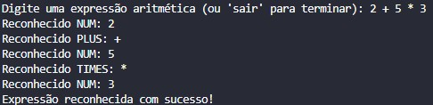
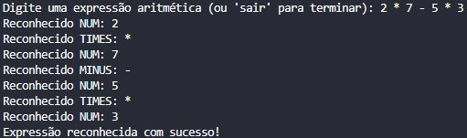

# TPC6: Analisador Lexical e Sintático para Expressões Aritméticas

## 20/03/2025

## Autor

- A94557
- Délio Miguel Lopes Alves

## Enunciado

Este projeto contém a criação de um analisador léxico (lexer) e um analisador sintático (parser) para identificar e validar expressões aritméticas básicas, como 2 + 5 * 3. O analisador léxico tem a função de dividir a entrada em tokens, enquanto o analisador sintático verifica se a sequência desses tokens está em conformidade com as regras gramaticais estabelecidas.

## Explicação

**Análise Léxica**:
   - Reconhece números inteiros (`NUM`).
   - Reconhece operadores aritméticos: `+` (PLUS), `-` (MINUS), `*` (TIMES).
   - Ignora espaços em branco e novas linhas (`\n`).

**Análise Sintática**:
   - Valida expressões aritméticas sem parênteses.
   - Respeita a precedência de operadores (multiplicação antes de adição e subtração).

## Resultados

### Exemplo 1

### Exemplo 2

